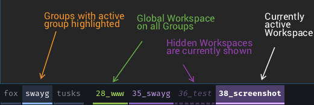

# sway-groups (`swayg`)

Group-aware workspace management for [sway](https://swaywm.org/), with
[waybar](https://github.com/Alexays/Waybar) integration via
[waybar-dynamic](https://github.com/AriaSeitia/waybar-dynamic).

> **On "optional" bar integration.** In principle `swayg` is bar-agnostic —
> it manages state in sway, and the bar integration is a separate output
> channel. In practice waybar + waybar-dynamic is currently the only
> supported renderer, and without it there is no visible feedback on
> which groups exist or which workspaces the active group contains. So
> unless you plan to write your own bar module against the
> [waybar-dynamic IPC](https://github.com/AriaSeitia/waybar-dynamic),
> treat waybar as a required dependency.

Workspaces are organised into named **groups**. Each output has an **active
group**, and only workspaces that belong to the active group (plus globals
and user-unhidden ones) are shown to waybar and included in group-aware
navigation. Workspace state is persisted in a small SQLite DB so switching
back to a group restores its last focus.

## Key concepts

- **Workspace** — a sway workspace (`1`, `2`, `3:Firefox`, …).
- **Group** — a named collection of workspaces. Each output has one *active*
  group at a time.
- **Global workspace** — visible in all groups (e.g. a persistent notes
  workspace).
- **Hidden workspace** — a workspace marked as hidden in a specific group.
  By default hidden workspaces are invisible to waybar and skipped by
  navigation, so you can declutter the bar during presentations or deep
  work. Toggle `show_hidden_workspaces` to reveal them with a `.hidden`
  CSS class applied (combinable with `.global`, `.focused`, …).

## Requirements

- Rust toolchain (stable, edition 2024)
- sway
- waybar + [waybar-dynamic](https://github.com/AriaSeitia/waybar-dynamic) — see note above

## Installation

### `cargo install --git` (recommended right now)

No crates.io publishing needed:

```sh
cargo install --git https://github.com/bschnitz/sway-groups swayg
cargo install --git https://github.com/bschnitz/sway-groups swayg-daemon
```

Both binaries land in `~/.cargo/bin/`. Make sure that's in your `PATH`.

### `cargo install --path` (from a local clone)

```sh
git clone https://github.com/bschnitz/sway-groups
cd sway-groups
cargo install --path sway-groups-cli
cargo install --path sway-groups-daemon
```

### Later: `cargo install` from crates.io

Once the crates are published (in order: `sway-groups-config` →
`sway-groups-core` → `sway-groups-cli` / `sway-groups-daemon`) it becomes:

```sh
cargo install sway-groups-cli
cargo install sway-groups-daemon
```

### systemd user unit for the daemon

`cargo install` cannot install non-binary files, so copy this unit once
into `~/.config/systemd/user/swayg-daemon.service`:

```ini
[Unit]
Description=swayg daemon - track external sway workspace events
After=graphical-session.target
PartOf=graphical-session.target

[Service]
Type=simple
ExecStart=%h/.cargo/bin/swayg-daemon
Restart=on-failure
RestartSec=5
Environment=RUST_LOG=sway_groups_daemon=info

[Install]
WantedBy=graphical-session.target
```

```sh
mkdir -p ~/.config/systemd/user
# paste the unit above into ~/.config/systemd/user/swayg-daemon.service
systemctl --user daemon-reload
systemctl --user enable --now swayg-daemon.service
```

The unit is `WantedBy=graphical-session.target`. For sway users, make sure
the target actually gets activated — the common recipe is a small session
target that sway starts. Create
`~/.config/systemd/user/sway-session.target`:

```ini
[Unit]
Description=sway compositor session
BindsTo=graphical-session.target
```

…and in your sway `config`:

```
exec systemctl --user --no-block start sway-session.target
```

### waybar-dynamic integration

Install [waybar-dynamic](https://github.com/AriaSeitia/waybar-dynamic),
then add two modules to your waybar config:

```jsonc
"cffi/swayg_groups": {
    "module_path": "/path/to/libwaybar_dynamic.so",
    "name": "swayg_groups"
},
"cffi/swayg_workspaces": {
    "module_path": "/path/to/libwaybar_dynamic.so",
    "name": "swayg_workspaces"
}
```

`swayg` pushes widget updates to these modules automatically after every
state-changing command. For per-state CSS classes see [Bar styling](#bar-styling)
below.

## First-time setup

```sh
swayg init             # creates the DB and imports current sway state
```

This seeds the DB from sway's current workspaces, creates the default
group (`0`), and pushes initial bar widgets.

## CLI overview

Every command is documented under `--help`:

```sh
swayg --help
swayg workspace --help
swayg workspace hide --help
```

High-level tour:

```sh
# Groups
swayg group create dev
swayg group select dev               # make dev the active group on current output
swayg group next -w                  # next group (alphabetical, wrap)
swayg group prune                    # delete empty groups

# Workspace membership
swayg workspace add 3 -g dev         # add workspace "3" to dev
swayg workspace move 3 -g dev,work   # set exactly these groups
swayg workspace global 1             # workspace 1 visible in all groups
swayg workspace rename old new       # rename (merges if target exists)

# Hiding
swayg workspace hide                 # hide currently focused workspace in active group
swayg workspace hide 4 -g dev -t     # toggle "4" hidden in group dev
swayg workspace unhide 4 -g dev
swayg group unhide-all               # unhide everything in active group
swayg workspace show-hidden -t       # toggle the global show_hidden flag

# Navigation (group-aware — skips hidden unless show_hidden=true)
swayg nav next -w                    # next visible workspace, wrap
swayg nav go 3                       # focus workspace 3 (works even if hidden)
swayg nav back                       # previous focus

# Container moves
swayg container move 3 --switch-to-workspace

# State
swayg status
swayg sync --all --repair
swayg config dump                    # print the default config TOML

# Global flags
swayg -v ...                         # verbose
swayg --db /tmp/test.db ...          # alternate DB file
swayg --config ~/my.toml ...         # alternate config file
```

`swayg status` sample:

```
show_hidden_workspaces = false
eDP-1: active group = "dev"
  Visible:  1, 3
  Inactive: 2, 4
  Hidden:   5
  Global:   0
```

- **Visible** — in the active group (plus globals) and not user-hidden
- **Inactive** — belongs to other groups; exists in sway on this output
- **Hidden** — user-hidden in the active group (only shown if
  `show_hidden_workspaces = true`)
- **Global** — `is_global = true` workspaces

## Configuration

`swayg config dump` prints the default TOML. Save to
`~/.config/swayg/config.toml` (or any path passed via `--config` or
`SWAYG_CONFIG=`) and edit.

Current sections:

- `[defaults]` — `default_group`, `default_workspace` (used when orphan
  workspaces need a home, e.g. after `group delete --force`)
- `[bar.workspaces]` / `[bar.groups]` — per-bar tuning: socket instance
  name, display mode (`all` | `active` | `none`), `show_global`,
  `show_empty`

Runtime DB flags (separate from the config file):

- `show_hidden_workspaces` — toggled via `swayg workspace show-hidden`

## Bar styling



Widgets emitted by `swayg` carry CSS classes you can style. The available
classes are:

- **`swayg_workspaces`**: `focused` (focused on this output), `visible`
  (visible on another output), `urgent`, `global` (`is_global` flag),
  `hidden` (only sent when `show_hidden_workspaces = true`). Classes
  combine, e.g. `.focused.global`, `.hidden.global.focused`.
- **`swayg_groups`**: `active` (active group on the focused output),
  `urgent` (a workspace in the group is urgent).

### Example theme (lavender workspaces, blue groups)

This is the theme used in the screenshot above — drop it into your
`~/.config/waybar/style.css`:

```css
/* ── swayg workspaces — lavender, lime accent for globals ───────── */
#waybar-dynamic.swayg_workspaces label {
    padding: 0 5px;
    background: transparent;
    color: #C9A0F8;
    border-bottom: 3px solid rgba(184, 133, 255, 0.7);
    border-radius: 0;
    transition: background 0.15s, color 0.15s;
}
#waybar-dynamic.swayg_workspaces label.focused {
    background: rgba(184, 133, 255, 0.35);
    color: #ffffff;
    border-bottom: 3px solid #D4AAFF;
}
#waybar-dynamic.swayg_workspaces label.visible {
    color: rgba(184, 133, 255, 0.75);
}
#waybar-dynamic.swayg_workspaces label.urgent {
    background-color: #e8453c;
    border-bottom: 3px solid #e8453c;
    color: #ffffff;
}
/* Global workspaces: lime text + border */
#waybar-dynamic.swayg_workspaces label.global {
    color: #b8f060;
    border-bottom: 3px solid rgba(184, 240, 96, 0.75);
}
#waybar-dynamic.swayg_workspaces label.focused.global {
    background: rgba(184, 133, 255, 0.3);
    color: #b8f060;
    border-bottom: 3px solid #b8f060;
}
#waybar-dynamic.swayg_workspaces label.global.visible {
    color: rgba(184, 240, 96, 0.6);
}
#waybar-dynamic.swayg_workspaces label.hover {
    background: rgba(184, 133, 255, 0.2);
}
#waybar-dynamic.swayg_workspaces label.focused.hover {
    background: rgba(184, 133, 255, 0.5);
}
#waybar-dynamic.swayg_workspaces label.global.hover {
    background: rgba(184, 240, 96, 0.15);
}
#waybar-dynamic.swayg_workspaces label.focused.global.hover {
    background: rgba(184, 133, 255, 0.45);
}

/* Hidden (only shown when show_hidden_workspaces = true):
   faded + italic + dashed border signals "would normally be invisible". */
#waybar-dynamic.swayg_workspaces label.hidden {
    opacity: 0.45;
    border-bottom: 3px dashed rgba(184, 133, 255, 0.7);
    font-style: italic;
}
#waybar-dynamic.swayg_workspaces label.hidden.focused {
    opacity: 0.8;
    background: rgba(184, 133, 255, 0.25);
    color: #ffffff;
    border-bottom: 3px dashed #D4AAFF;
}
#waybar-dynamic.swayg_workspaces label.hidden.visible {
    opacity: 0.55;
}
#waybar-dynamic.swayg_workspaces label.hidden.global {
    opacity: 0.5;
    color: #b8f060;
    border-bottom: 3px dashed rgba(184, 240, 96, 0.75);
    font-style: italic;
}
#waybar-dynamic.swayg_workspaces label.hidden.focused.global {
    opacity: 0.85;
    background: rgba(184, 133, 255, 0.25);
    color: #b8f060;
    border-bottom: 3px dashed #b8f060;
}
#waybar-dynamic.swayg_workspaces label.hidden.global.visible {
    opacity: 0.55;
}
/* Urgent wins: full visibility, solid border, no italic */
#waybar-dynamic.swayg_workspaces label.hidden.urgent {
    opacity: 1.0;
    background-color: #e8453c;
    border-bottom: 3px solid #e8453c;
    color: #ffffff;
    font-style: normal;
}
#waybar-dynamic.swayg_workspaces label.hidden.hover {
    opacity: 0.7;
    background: rgba(184, 133, 255, 0.15);
}
#waybar-dynamic.swayg_workspaces label.hidden.focused.hover {
    opacity: 0.95;
    background: rgba(184, 133, 255, 0.4);
}
#waybar-dynamic.swayg_workspaces label.hidden.global.hover {
    opacity: 0.7;
    background: rgba(184, 240, 96, 0.1);
}

/* ── swayg groups — same structure, blue accent ─────────────────── */
#waybar-dynamic.swayg_groups label {
    padding: 0 5px;
    background: transparent;
    color: rgba(255, 255, 255, 0.5);
    border-bottom: 3px solid rgba(137, 180, 250, 0.3);
    border-radius: 0;
}
#waybar-dynamic.swayg_groups label.active {
    color: #ffffff;
    background: rgba(137, 180, 250, 0.15);
    border-bottom: 3px solid #89b4fa;
}
#waybar-dynamic.swayg_groups label.urgent {
    background-color: #eb4d4b;
    color: #ffffff;
}
#waybar-dynamic.swayg_groups label.hover {
    background: rgba(100, 114, 125, 0.3);
}
#waybar-dynamic.swayg_groups label.active.hover {
    background: rgba(137, 180, 250, 0.3);
}
```

## Storage locations

- SQLite DB: `~/.local/share/swayg/swayg.db`
- Log files: `~/.local/share/swayg/swayg.YYYY-MM-DD` (daily rotation)
- Config (optional): `~/.config/swayg/config.toml`
- Daemon state: `/tmp/swayg-daemon-test.state` (test daemon only)

Reset all state:

```sh
rm ~/.local/share/swayg/swayg.db
swayg init
```

## Architecture

Workspace crates:

| Crate | Role |
|---|---|
| `sway-groups-config` | TOML config schema + loader |
| `sway-groups-core` | DB entities, services, sway/waybar IPC |
| `sway-groups-cli` → `swayg` | User-facing CLI |
| `sway-groups-daemon` → `swayg-daemon` | Catches sway IPC events (new/empty workspace, etc.), keeps DB + bars in sync |
| `sway-groups-dummy-window` | Wayland dummy window for tests (`publish = false`) |
| `sway-groups-tests` | Integration tests against a live sway session (`publish = false`) |

### Tables

- `workspaces`, `groups` — main entities
- `workspace_groups` — many-to-many membership
- `hidden_workspaces` — presence-based `(workspace_id, group_id)` pairs
- `outputs` — per-output state (including active group)
- `settings` — global runtime flags (key/value)
- `focus_history`, `group_state`, `pending_workspace_events` — internal
  state for nav-back and daemon coordination

## Troubleshooting

- `RUST_LOG=debug swayg <cmd>` — verbose tracing to stderr
- Log files under `~/.local/share/swayg/`
- `swayg repair` — reconcile DB with sway (removes stale workspaces etc.)
- `swayg sync --all --init-bars --init-bars-retries 20 --init-bars-delay-ms 500`
  — after `swaymsg reload`, retry pushing to waybar until its socket is
  back up

## Development

```sh
cargo build --workspace
cargo test -p sway-groups-tests -- --test-threads=1   # integration tests need a serialised sway session
cargo clippy --workspace --all-targets
```

The integration test suite spawns a test-mode daemon, temporarily stops
the production daemon, and tears everything down in `Drop`. All tests
must be able to run against a real sway socket.

### Waybar test progress

During test runs a waybar `custom` module shows which test is running
and overall progress (n/m). The test fixture writes JSON to
`/tmp/swayg-test-progress.json` which waybar polls every second.

Add the module to your waybar config (e.g. in `modules-center`):

```jsonc
"custom/swayg_tests": {
    "exec": "cat /tmp/swayg-test-progress.json 2>/dev/null || echo '{}'",
    "return-type": "json",
    "interval": 1,
    "tooltip": true
}
```

Suggested CSS (pill badge, yellow while running, green when done):

```css
#custom-swayg_tests {
    padding: 2px 12px;
    margin: 4px 0;
    background: rgba(80, 80, 100, 0.4);
    color: rgba(255, 255, 255, 0.5);
    border-radius: 12px;
    font-size: 12px;
}
#custom-swayg_tests.running {
    color: #1e1e2e;
    background: #fac850;
    font-weight: bold;
}
#custom-swayg_tests.done {
    color: #1e1e2e;
    background: #a6e3a1;
    font-weight: bold;
}
```

## License

MIT
