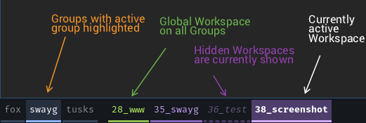

# sway-groups (`swayg`)

Group-aware workspace management for [sway](https://swaywm.org/), with
[waybar](https://github.com/Alexays/Waybar) integration via
[waybar-dynamic](https://github.com/bschnitz/waybar-dynamic).

(Theoretically waybar is an optional dependency, but there are not yet any other
adapters for other bars.)

Workspaces are organised into named **groups**. Each output has an **active
group**, and only workspaces that belong to the active group (plus globals
and user-unhidden ones) are shown to waybar and included in group-aware
navigation. Workspace state is persisted in a small SQLite DB so switching
back to a group restores its last focus.

## Key concepts

- **Workspace** — a sway workspace (`1`, `2`, `3:Firefox`, …).
- **Group** — a named collection of workspaces. Each output has one _active_
  group at a time.
- **Global workspace** — visible in all groups (e.g. a persistent notes
  workspace).
- **Hidden workspace** — a workspace marked as hidden in a specific group.
  By default hidden workspaces are invisible to waybar and skipped by
  navigation, so you can declutter the bar during presentations or deep
  work. Toggle `show_hidden_workspaces` to reveal them with a `.hidden`
  CSS class applied (combinable with `.global`, `.focused`, …).



## Setup overview

1. [Install the CLI](#1-install-the-cli) (`swayg`)
2. [Install and start the daemon](#2-install-and-start-the-daemon) (`swayg-daemon`)
3. [Install waybar-dynamic](#3-install-waybar-dynamic)
4. [Configure waybar](#4-configure-waybar)
5. [Style the bar](#5-style-the-bar)
6. [Use the CLI and bind keys](#6-use-the-cli-and-bind-keys)

### 1. Install the CLI

Requires a Rust toolchain (stable, edition 2024).

**From crates.io:**

```sh
cargo install sway-groups-cli
```

**From git (latest development version):**

```sh
cargo install --git https://github.com/bschnitz/sway-groups sway-groups-cli
```

**From a local clone:**

```sh
git clone https://github.com/bschnitz/sway-groups
cd sway-groups
cargo install --path sway-groups-cli
```

The binary `swayg` lands in `~/.cargo/bin/`. Make sure that's in your `PATH`.

### 2. Install and start the daemon

The daemon watches sway IPC events (workspace creation/deletion, focus and
urgency changes) and keeps the DB and bar in sync.

**Install:**

```sh
cargo install sway-groups-daemon        # from crates.io
# or
cargo install --git https://github.com/bschnitz/sway-groups sway-groups-daemon
```

**Option A: systemd user service (recommended)**

Create `~/.config/systemd/user/swayg-daemon.service`:

```ini
[Unit]
Description=swayg daemon - track external sway workspace events
After=graphical-session.target
PartOf=graphical-session.target

[Service]
Type=simple
ExecStart=%h/.cargo/bin/swayg-daemon
Restart=on-failure
RestartSec=5
Environment=RUST_LOG=swayg_daemon=info

[Install]
WantedBy=graphical-session.target
```

```sh
systemctl --user daemon-reload
systemctl --user enable --now swayg-daemon.service
```

The unit is `WantedBy=graphical-session.target`. For sway users, make sure
the target actually gets activated. Create
`~/.config/systemd/user/sway-session.target`:

```ini
[Unit]
Description=sway compositor session
BindsTo=graphical-session.target
```

…and in your sway `config`:

```
exec systemctl --user --no-block start sway-session.target
```

**Option B: start directly from sway config (no systemd)**

Add to your sway `config`:

```
exec swayg-daemon
```

The daemon runs in the foreground and exits when sway exits. It logs at `info`
to `~/.local/share/swayg/swayg-daemon.log.YYYY-MM-DD` (see
[Storage locations](#storage-locations)). For more detail, raise the level; the
log target is the binary's name, `swayg_daemon`, not the crate's:

```
exec RUST_LOG=swayg_daemon=debug swayg-daemon
```

### 3. Install waybar-dynamic

[waybar-dynamic](https://github.com/bschnitz/waybar-dynamic) is the CFFI
module that renders swayg's widgets in waybar. Follow its
[installation instructions](https://github.com/bschnitz/waybar-dynamic#installation)
— in short:

```sh
git clone https://github.com/bschnitz/waybar-dynamic
cd waybar-dynamic
cargo build --release
mkdir -p ~/.config/waybar/modules
cp target/release/libwaybar_dynamic.so ~/.config/waybar/modules/
```

### 4. Configure waybar

Add two waybar-dynamic modules to your `~/.config/waybar/config.jsonc` — one
for groups, one for workspaces:

<!-- Kept verbatim: prettier would add trailing commas, which waybar rejects. -->
<!-- prettier-ignore -->
```jsonc
{
    "modules-left": [
        "cffi/swayg_groups",
        "cffi/swayg_workspaces"
    ],

    "cffi/swayg_groups": {
        "module_path": "~/.config/waybar/modules/libwaybar_dynamic.so",
        "name": "swayg_groups"
    },
    "cffi/swayg_workspaces": {
        "module_path": "~/.config/waybar/modules/libwaybar_dynamic.so",
        "name": "swayg_workspaces"
    }
}
```

`swayg` pushes widget updates to these modules automatically after every
state-changing command.

### 5. Style the bar

Widgets carry CSS classes you can style in `~/.config/waybar/style.css`:

- **`swayg_workspaces`**: `focused`, `visible`, `urgent`, `global`,
  `hidden` (only when `show_hidden_workspaces = true`). Classes combine,
  e.g. `.focused.global`, `.hidden.global.focused`.
- **`swayg_groups`**: `active`, `urgent` (a workspace in the group is
  urgent).

**Example theme** (lavender workspaces, blue groups — as in the screenshot):

```css
/* ── swayg workspaces — lavender, lime accent for globals ───────── */
#waybar-dynamic.swayg_workspaces label {
  padding: 0 5px;
  background: transparent;
  color: #c9a0f8;
  border-bottom: 3px solid rgba(184, 133, 255, 0.7);
  border-radius: 0;
  transition:
    background 0.15s,
    color 0.15s;
}
#waybar-dynamic.swayg_workspaces label.focused {
  background: rgba(184, 133, 255, 0.35);
  color: #ffffff;
  border-bottom: 3px solid #d4aaff;
}
#waybar-dynamic.swayg_workspaces label.visible {
  color: rgba(184, 133, 255, 0.75);
}
#waybar-dynamic.swayg_workspaces label.urgent {
  background-image: linear-gradient(
    to top,
    transparent,
    rgba(232, 69, 60, 0.7)
  );
  color: #ffffff;
}
#waybar-dynamic.swayg_workspaces label.global {
  color: #b8f060;
  border-bottom: 3px solid rgba(184, 240, 96, 0.75);
}
#waybar-dynamic.swayg_workspaces label.focused.global {
  background: rgba(184, 133, 255, 0.3);
  color: #b8f060;
  border-bottom: 3px solid #b8f060;
}
#waybar-dynamic.swayg_workspaces label.hover {
  background: rgba(184, 133, 255, 0.2);
}

/* Hidden workspaces: faded + italic + dashed border */
#waybar-dynamic.swayg_workspaces label.hidden {
  opacity: 0.45;
  border-bottom: 3px dashed rgba(184, 133, 255, 0.7);
  font-style: italic;
}
#waybar-dynamic.swayg_workspaces label.hidden.focused {
  opacity: 0.8;
  background: rgba(184, 133, 255, 0.25);
  color: #ffffff;
  border-bottom: 3px dashed #d4aaff;
}
#waybar-dynamic.swayg_workspaces label.hidden.urgent {
  opacity: 1;
  background-image: linear-gradient(
    to top,
    transparent,
    rgba(232, 69, 60, 0.7)
  );
  color: #ffffff;
  font-style: normal;
}

/* ── swayg groups — blue accent ─────────────────────────────────── */
#waybar-dynamic.swayg_groups label {
  padding: 0 5px;
  background: transparent;
  color: rgba(255, 255, 255, 0.5);
  border-bottom: 3px solid rgba(137, 180, 250, 0.3);
  border-radius: 0;
}
#waybar-dynamic.swayg_groups label.active {
  color: #ffffff;
  background: rgba(137, 180, 250, 0.15);
  border-bottom: 3px solid #89b4fa;
}
#waybar-dynamic.swayg_groups label.urgent {
  background-image: linear-gradient(
    to top,
    transparent,
    rgba(235, 77, 75, 0.7)
  );
  color: #ffffff;
}
#waybar-dynamic.swayg_groups label.hover {
  background: rgba(100, 114, 125, 0.3);
}
#waybar-dynamic.swayg_groups label.active.hover {
  background: rgba(137, 180, 250, 0.3);
}
```

### 6. Use the CLI and bind keys

**First-time setup:**

```sh
swayg init             # creates the DB and imports current sway state
```

This seeds the DB from sway's current workspaces, creates the default
group (`0`), and pushes initial bar widgets.

**Example sway keybindings** (add to your sway `config`):

```
# Switch groups
bindsym $mod+a exec swayg group next -w
bindsym $mod+d exec swayg group prev -w

# Navigate workspaces within active group
bindsym $mod+n exec swayg nav next -w
bindsym $mod+p exec swayg nav prev -w

# Move container to workspace
bindsym $mod+Shift+n exec swayg container move next --switch-to-workspace

# Re-sync after swaymsg reload
bindsym $mod+r exec sh -c 'swaymsg reload && sleep 0.3 && swayg sync --init-bars --init-bars-retries 20 --init-bars-delay-ms 500'
```

**CLI overview:**

Every command is documented under `--help`:

```sh
swayg --help
swayg workspace --help
swayg workspace hide --help
```

High-level tour:

```sh
# Groups
swayg group create dev
swayg group select dev               # make dev the active group on current output
swayg group next -w                  # next group (alphabetical, wrap)
swayg group prune                    # delete empty groups

# Workspace membership
swayg workspace add 3 -g dev         # record workspace "3" in dev (DB only)
swayg workspace add 3 -g dev -c 94   # ... and materialise it with container 94
swayg workspace move 3 -g dev,work   # set exactly these groups
swayg workspace global 1             # workspace 1 visible in all groups
swayg workspace rename old new       # rename (merges if target exists)

# Hiding (auto-focuses away when the focused workspace becomes invisible)
swayg workspace hide                 # hide currently focused workspace in active group
swayg workspace hide 4 -g dev -t     # toggle "4" hidden in group dev
swayg workspace unhide 4 -g dev
swayg group unhide-all               # unhide everything in active group
swayg workspace show-hidden -t       # toggle the global show_hidden flag

# Navigation (group-aware — skips hidden unless show_hidden=true)
swayg nav next -w                    # next visible workspace, wrap
swayg nav go 3                       # focus workspace 3 (works even if hidden)
swayg nav go 3 -g dev                # ... and file it in "dev" if nothing knows where it belongs
swayg nav back                       # previous focus

# Container moves
swayg container move 3                    # move the focused container to "3"
swayg container move 3 --con-id 94        # move that container instead
swayg container move 3 --switch-to-workspace

# State
swayg status
swayg sync --all --repair
swayg config dump                    # print the default config TOML

# Global flags
swayg -v ...                         # verbose
swayg --db /tmp/test.db ...          # alternate DB file
swayg --config ~/my.toml ...         # alternate config file
swayg --json status                  # machine-readable answer (see below)
```

### Machine-readable output (`--json`)

The read commands `group list`, `workspace list`, `workspace groups` and
`status` also answer as JSON:

```bash
swayg --json workspace list
swayg workspace list --json          # the flag is global, position is free
```

It exists so that programs stop parsing the human text. The text form is meant
for eyes and is free to be reworded; the JSON is the interface, and it carries
the full shape regardless of the presentation flags — `--plain`, `--groups` and
`--flatten` only shape the text and are ignored in JSON. `--visible` is not a
presentation flag but a filter, so it does change the JSON: it answers with the
names of the workspaces the output currently shows.

Every other command keeps printing its one-line confirmation.

### Adding a workspace sway does not know yet

`swayg workspace add` records membership in the database; it never switches your
view to bring the workspace into existence. Sway only creates a workspace when
something is put on it, so a switch would strand you on an empty workspace that
sway destroys again the moment you leave — and the resulting event looks to the
daemon like a workspace created behind its back.

So there are two honest ways to end up with a real workspace:

- `swayg workspace add 3 -g dev --container <con_id>` moves an existing window
  into the new workspace, which materialises it. Your focus stays where it is.
  `swaymsg -t get_tree` gives you the `con_id`.
- Add it DB-only and let it materialise later, the first time a window lands
  there. `swayg workspace add` prints a note to stderr in this case.

`swayg container move <ws>` moves the focused container by default; pass
`--con-id <id>` to move a specific one instead.

### Jumping to a workspace that no longer exists

Sway destroys a workspace together with its last window. The destruction takes
the workspace's group memberships with it, and an emptied group is pruned on
top of that -- so a workspace you use every day is regularly absent from the
database, group and all.

`swayg nav go` restores that before it jumps. Where the workspace belongs is
already written down in the [assignment rules](#assignment-rules), the same
rules the daemon uses to file a newly created workspace:

```toml
[[assign]]
match = "3"
groups = ["dev"]
```

With that rule in place, `swayg nav go 3` recreates the group if it is gone,
files the workspace in it, makes it the active group, and only then focuses the
workspace. Without it, the jump would focus the workspace while the output still
stood in the group it came from: the window appears, but the bar and every
group-relative binding still belong to the old group.

For a caller that knows the group at runtime but has no rule for it, `--group`
(repeatable) says the same thing on the command line:

```sh
swayg nav go 3 --group dev
```

Both are a fallback, not an override. They are consulted only when the
workspace has no group membership at all -- a workspace that is still filed
somewhere is never refiled.

A rule with `global = true` is restored the same way: `nav go` marks the
recreated workspace global again instead of filing it into the active group.

### Focus changes that do not go through swayg

Not every focus change is a `swayg` command. A `swaymsg workspace 3`, a
launcher that runs `swaymsg '[app_id=…] focus'`, a click on a notification that
takes you to its window: sway moves the focus and the database never hears of
it. If the workspace belongs to a group other than the active one, the bar would
go on listing the group you left.

The daemon therefore follows the focus. When the focused workspace is not in its
output's active group, it makes one of the workspace's groups active — the one
you visited last — and redraws both bars. It changes the database only; sway is
already where it should be, so the daemon issues no sway command of its own. A
global workspace, or one that is also in the active group, leaves the active
group alone. The group you left remembers the workspace you left it on, so
selecting it again takes you back there.

`swayg`'s own commands move the focus as well. So that the daemon never undoes
one halfway through, it waits until the focus has been still for 150 ms, then
compares where sway's focus is _now_ with the database, and does nothing while a
`swayg` command has a workspace event pending.

`swayg status` sample:

```
show_hidden_workspaces = false
eDP-1: active group = "dev"
  Visible:  1, 3
  Inactive: 2, 4
  Hidden:   5
  Global:   0
```

- **Visible** — in the active group (plus globals) and not user-hidden
- **Inactive** — belongs to other groups; exists in sway on this output
- **Hidden** — user-hidden in the active group (only shown if
  `show_hidden_workspaces = true`)
- **Global** — `is_global = true` workspaces

## Configuration

`swayg config dump` prints the default TOML. Save to
`~/.config/swayg/config.toml` (or any path passed via `--config` or
`SWAYG_CONFIG=`) and edit.

Current sections:

- `[defaults]` — `default_group`, `default_workspace` (used when orphan
  workspaces need a home, e.g. after `group delete --force`)
- `[bar.workspaces]` / `[bar.groups]` — per-bar tuning: socket instance
  name, display mode (`all` | `active` | `none`), `show_global`,
  `show_empty`
- `[[assign]]` — workspace assignment rules (see below)

### Assignment rules

When the daemon sees a new workspace, it normally adds it to the active
group. Assignment rules let you override this per workspace name — useful
together with sway's `assign` / `for_window` rules:

```toml
# Exact match: put "music" in media + bg, mark global
[[assign]]
match = "music"
groups = ["media", "bg"]
global = true

# Regex match: any workspace starting with "dev_" goes to dev group
[[assign]]
match = "^dev_"
match_type = "regex"
groups = ["dev"]
```

- `match` — pattern to match against the workspace name.
- `match_type` — `"exact"` (default) or `"regex"`.
- `groups` — groups to add the workspace to. When set, replaces the
  default "add to active group" behaviour.
- `global` — mark the workspace as global (`true`/`false`).

If a rule sets `global = true` but specifies no `groups`, the workspace
is still added to the active group (in addition to being global).
Multiple rules can match the same workspace — their groups are merged.

The rules answer two questions, not one. The daemon reads them when sway
creates a workspace, and `swayg nav go` reads them when it is asked to jump to
a workspace the database has forgotten — see [jumping to a workspace that no
longer exists](#jumping-to-a-workspace-that-no-longer-exists). A rule is
therefore worth writing for every workspace that sway's own `assign` fills:
without one, both paths fall back to whatever group happens to be active.

Runtime DB flags (separate from the config file):

- `show_hidden_workspaces` — toggled via `swayg workspace show-hidden`

## Storage locations

- SQLite DB: `~/.local/share/swayg/swayg.db`
- Log files (daily rotation): `~/.local/share/swayg/swayg.YYYY-MM-DD` for the
  CLI, `~/.local/share/swayg/swayg-daemon.log.YYYY-MM-DD` for the daemon
- Config (optional): `~/.config/swayg/config.toml`

Reset all state:

```sh
rm ~/.local/share/swayg/swayg.db
swayg init
```

## Architecture

| Crate                                 | Role                                                                      |
| ------------------------------------- | ------------------------------------------------------------------------- |
| `sway-groups-config`                  | TOML config schema + loader                                               |
| `sway-groups-core`                    | DB entities, services, sway/waybar IPC                                    |
| `sway-groups-cli` → `swayg`           | User-facing CLI                                                           |
| `sway-groups-daemon` → `swayg-daemon` | Catches sway IPC events, keeps DB + bars in sync                          |
| `sway-groups-dummy-window`            | Wayland dummy window for tests (`publish = false`)                        |
| `sway-groups-tests`                   | Integration tests, each against its own headless sway (`publish = false`) |

## Troubleshooting

- `swayg --verbose <cmd>` — debug tracing to stderr (without it, stderr shows
  warnings only; the log file always keeps info and above)
- Log files under `~/.local/share/swayg/`
- `swayg repair` — reconcile DB with sway (removes stale workspaces etc.)
- `swayg sync --all --init-bars --init-bars-retries 20 --init-bars-delay-ms 500`
  — after `swaymsg reload`, retry pushing to waybar until its socket is
  back up

## Development

```sh
cargo build --workspace
cargo test -p sway-groups-tests --no-fail-fast        # integration tests, one headless sway each
cargo clippy --workspace --all-targets
```

Each integration test starts its own headless sway (`WLR_BACKENDS=headless`)
on a private socket and points `SWAYSOCK`/`WAYLAND_DISPLAY` at it, so the
binary under test, its daemon and the dummy windows all land there. It also
gets an `XDG_RUNTIME_DIR` of its own, which is where the bar sockets are looked
up -- otherwise a test run would push its throwaway workspaces to your waybar --
and a `SWAYG_CONFIG` of its own pointing at a file that does not exist, so the
binaries use their built-in defaults instead of your `config.toml`.
Whatever a test does to workspaces, groups or focus dies with its compositor;
your own session is never touched, and the production daemon keeps running.
The harness also builds the three binaries itself and takes their paths from
cargo's JSON output, so a test can never run against a stale
`target/debug/swayg`. The rules for writing one are in
[`sway-groups-tests/AI_TEST_INSTRUCTIONS.md`](sway-groups-tests/AI_TEST_INSTRUCTIONS.md).

### Waybar test progress

During test runs a waybar `custom` module shows which test is running
and overall progress (n/m). The test fixture writes JSON to
`/tmp/swayg-test-progress.json` which waybar polls every second.

The module ignores the file once it goes untouched for five seconds, so the
badge clears itself however the run ends -- completed, failed, or interrupted.
No test needs to switch it off, which is just as well: cargo runs one process
per test binary and none of them knows it is the last.

Add the module to your waybar config (e.g. in `modules-center`):

<!-- Kept verbatim: prettier would add trailing commas, which waybar rejects. -->
<!-- prettier-ignore -->
```jsonc
"custom/swayg_tests": {
    "exec": "find /tmp/swayg-test-progress.json -newermt '-5 seconds' -exec cat {} + 2>/dev/null | grep . || echo '{}'",
    "return-type": "json",
    "interval": 1,
    "tooltip": true
}
```

Suggested CSS (pill badge, yellow while running, green when done):

```css
#custom-swayg_tests {
  padding: 2px 12px;
  margin: 4px 0;
  background: rgba(80, 80, 100, 0.4);
  color: rgba(255, 255, 255, 0.5);
  border-radius: 12px;
  font-size: 12px;
}
#custom-swayg_tests.running {
  color: #1e1e2e;
  background: #fac850;
  font-weight: bold;
}
#custom-swayg_tests.done {
  color: #1e1e2e;
  background: #a6e3a1;
  font-weight: bold;
}
```

## License

MIT
